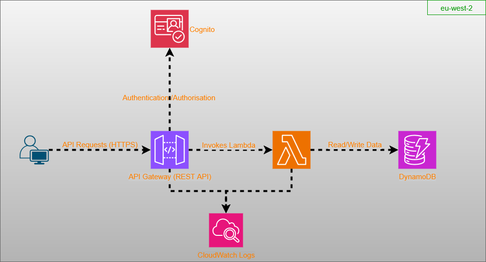

# Manually Deployed Secure Serverless CRUD API Deployment

## Project Overview
This project outlines the deployment of a secure, serverless CRUD (Create, Read, Update, Delete) API designed to manage product data. It leverages a suite of AWS services to provide a highly scalable, cost-effective, and robust backend solution. The API supports standard data operations and integrates user authentication for secure access to endpoints.



## Features

* Product Management: Supports full CRUD operations (Create, Read, Update, Delete) for product items.
* Serverless Architecture: Utilizes AWS Lambda for compute, eliminating server management overhead.
* Data Persistence: Employs Amazon DynamoDB as a NoSQL database for storing product data.
* API Exposure: Exposes RESTful API endpoints via Amazon API Gateway.
* User Authentication: Implements secure user authentication for API access using Amazon Cognito.
* Monitoring & Logging: Integrates with AWS CloudWatch for comprehensive logging and monitoring of API and Lambda function performance.
* test
* 
## Technologies Used
AWS Services:
 - Amazon DynamoDB: NoSQL database for flexible and scalable data storage.
 - AWS Lambda: Serverless compute service for API logic (Python 3.9 runtime).
 - AWS Identity and Access Management (IAM): For managing permissions and secure access.
 - Amazon API Gateway: To create, publish, maintain, monitor, and secure REST APIs.
 - Amazon Cognito: For user authentication and authorization.
 - Amazon CloudWatch: For monitoring and logging API and Lambda executions.
Programming Language:
 - Python 3.9 (for Lambda functions)
Tools:
 - AWS Command Line Interface (CLI)
 - cURL (for API testing)

## Getting Started

### Prerequisites 
* An active AWS Account.
* AWS CLI installed and configured with appropriate credentials.
* 
### Deployment Steps

1. DynamoDB Table Creation: Set up the `ProductsTable` in DynamoDB.
2. Lambda Function Creation: Create four Python 3.9 Lambda functions for Create (`createproductfunction`), Read (`getproductfunction`), Update (`updateproductfunction`), and Delete (`deleteproductfunction`) operations.
3. IAM Permissions Configuration: Configure IAM roles and inline policies for each Lambda function to grant necessary DynamoDB and CloudWatch permissions.
4. API Gateway Setup: Create a REST API (`ProductsAPI`) in API Gateway, defining resources (`/products`, `/{productId}`) and integrating them with the respective Lambda functions.
5. API Deployment: Deploy the API Gateway to a stage (i.e. `dev`) to obtain an Invoke URL.
6. Cognito User Pool Integration: Create and configure an Amazon Cognito User Pool (`secure-serverless-app`) for user authentication. Integrate this User Pool as an Authorizer for the API Gateway methods.
7. Lambda Code Modification: Update Lambda functions to process authenticated requests using claims from the Cognito Authorizer.

## Usage 
Once deployed, you can interact with the API using the AWS CLI for user management and `cURL` for authenticated API requests.

1.  Create and Confirm a Test User: Use AWS CLI commands to sign up and confirm a user in your Cognito User Pool.
    ```bash
    aws cognito-idp sign-up --region eu-west-2 --client-id <ProductsWebAppClient Client ID> --username testuser --password MySecurePass1! --user-attributes Name="email",Value="testuser@example.com"
    aws cognito-idp admin-confirm-sign-up --region eu-west-2 --user-pool-id <COGNITO_USER_POOL_ID> --username testuser
    ```
2.  Obtain Authentication Token (JWT): Sign in to Cognito using the CLI to get an `IdToken`.
    ```bash
    aws cognito-idp initiate-auth --region eu-west-2 --auth-flow USER_PASSWORD_AUTH --client-id <APP_Client_ID> --auth-parameters USERNAME=testuser,PASSWORD=MySecurePass1!
    ```
3.  Test Secured Endpoints with cURL: Use the obtained `IdToken` in the `Authorization` header to make requests to your API Gateway endpoints.
    ```bash
    curl -v -X POST \
    -H "Content-Type: application/json" \
    -H "Authorization: Bearer <PUT Id Token value here>" \
    -d '{
        "productId": "PROD001",
        "category": "Electronics",
        "productName": "Smartphone Model X",
        "description": "Latest model smartphone with advanced features.",
        "productPrice": 799,
        "stock": 150
    }' \
    "https://<YOUR_API_GATEWAY_INVOKE_URL>/products"
    ```

## Lessons Learned & Challenges Overcome

- This was my first time experimenting with APIs. Learning about different types of authentication tokens and error responses were great for my development. The ability to build a serverless application was something I'd not ever heard of. I will look to try and advance this from more than a portfolio project to a much larger scale project.
- One of the largest challenges I had was configuring the lambda functions. Ensuring the functions were correctly configured. When testing my code I had realised the error messages I was getting were due to the categories in the JSON test file and not the Python code. The mistakes helped me learn how to troubleshoot a new type of problem that I had not experienced before. 

## Future Enhancements

1. The first enhancement will be the automation of the creation proces. It will make it much easier to scale and manage configurations and updates.
2. Integrate with secrets manager to securely store API keys rather than hardcoding them.
3. Look at configuring API cachiing to reduce the number of requests to Lambda functions and DynamoDB

