## Phase 1: DynamoDB Table Creation

 - Access DynamoDB Console:
   - Log in to the AWS Management Console.
   - Navigate to the DynamoDB service.
 - Create Table:
   - Click *Create table*.
   - Table name: `ProductsTable`.
   - Partition key: productId (String).
   - (Optional) Sort key: category (String).
   - Table settings: Leave default settings for now (on-demand capacity, no secondary indexes initially).
   - Click *Create table*.


## Phase 2: Lambda Function Creation (Python)
 - Access Lambda Console:
   - Navigate to the Lambda service in the AWS Management Console.

### `createproductfunction` (POST)
 - Click *Create function*.
   - Author from scratch: Select this option.
   - `createproductfunction`
   - Runtime: Select Python 3.9.
   - Architecture: x86_64.
   - Execution role:
   - Select "Create a new role with basic Lambda permissions". This will create a basic role that allows Lambda to write logs to CloudWatch.
   - Click *Create function*.
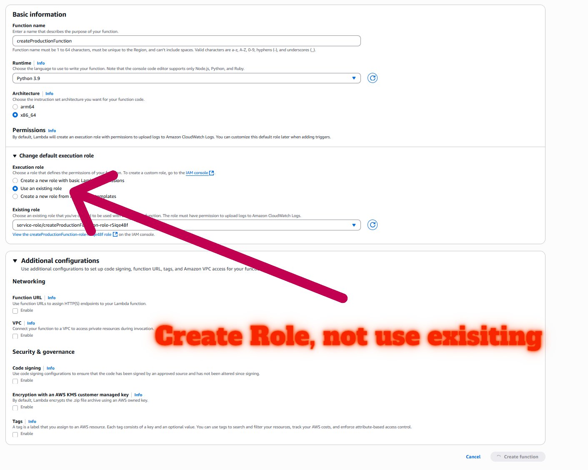
 - Configure Function Code for each Lambda (Python):
   - Once the function is created, you'll be on its configuration page.
   - Scroll down to the "Code source" section.
   - Replace the default code with the below Python code.

```python
import json
import boto3
from botocore.exceptions import ClientError
import os 

dynamodb = boto3.resource('dynamodb')
table_name = os.environ.get('TABLE_NAME', 'ProductsTable')
table = dynamodb.Table(table_name)

def lambda_handler(event, context):
    print(f"Received event: {event}")

    product_data = None
    if 'body' in event and isinstance(event['body'], str):
        try:
            product_data = json.loads(event['body'])
        except json.JSONDecodeError:
            print("Invalid JSON format in event['body']")
            return {
                'statusCode': 400,
                'headers': {'Content-Type': 'application/json'},
                'body': json.dumps('Invalid JSON format in request body.')
            }
    else:
        product_data = event

    if not product_data:
        print("No valid product_data extracted from event.")
        return {
            'statusCode': 400,
            'headers': {'Content-Type': 'application/json'},
            'body': json.dumps('No data provided in the request.')
        }

    required_fields = ['productId', 'category', 'productName', 'productPrice']
    missing_fields = [field for field in required_fields if field not in product_data]

    if missing_fields:
        print(f"Missing required fields: {', '.join(missing_fields)}")
        return {
            'statusCode': 400,
            'headers': {'Content-Type': 'application/json'},
            'body': json.dumps(f"Missing required fields: {', '.join(missing_fields)}")
        }

    try:
        product_id = product_data['productId']
        category = product_data['category']
        product_name = product_data['productName']
        product_price = product_data['productPrice']

        item = {
            'productId': product_id,
            'category': category,
            'productName': product_name,
            'productPrice': product_price
        }
        for key, value in product_data.items():
            if key not in required_fields:
                item[key] = value

        print(f"Attempting to put item: {item}")
        table.put_item(Item=item)
        print("Item put successfully!")

        return {
            'statusCode': 200,
            'headers': {
                'Content-Type': 'application/json'
            },
            'body': json.dumps({'message': 'Product created successfully!', 'productId': product_id, 'category': category})
        }
    except ClientError as e:
        error_message = e.response['Error']['Message']
        print(f"DynamoDB Client Error: {error_message}")
        return {
            'statusCode': 500,
            'headers': {
                'Content-Type': 'application/json'
            },
            'body': json.dumps(f"Database error: {error_message}")
        }
    except Exception as e:
        print(f"Unexpected Error: {str(e)}")
        return {
            'statusCode': 500,
            'headers': {
                'Content-Type': 'application/json'
            },
            'body': json.dumps(f"Internal server error: {str(e)}")
        } 
```


### `getproductfunction` (GET)

 - Click *Create function*.
   - Author from scratch: Select this option.
   - `getproductfunction`
   - Runtime: Select Python 3.9.
   - Architecture: x86_64.
   - Execution role:
   - Select "Create a new role with basic Lambda permissions". This will create a basic role that allows Lambda to write logs to CloudWatch.
   - Click *Create function*.
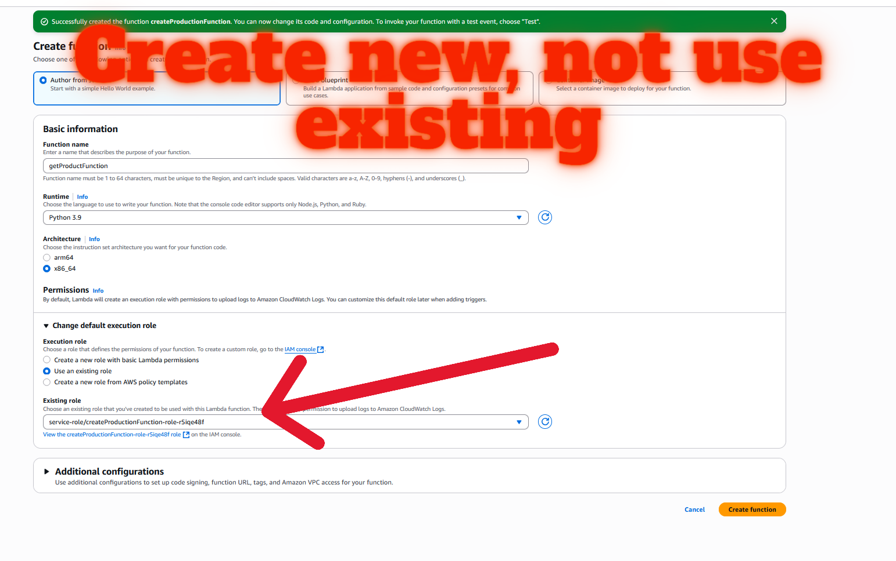
 - Configure Function Code for each Lambda (Python):
   - Once the function is created, you'll be on its configuration page.
   - Scroll down to the "Code source" section.
   - Replace the default code with the below Python code.

```python
import json
import boto3
from botocore.exceptions import ClientError
import os
from decimal import Decimal

class DecimalEncoder(json.JSONEncoder):
    def default(self, obj):
        if isinstance(obj, Decimal):
            if obj % 1 == 0:
                return int(obj)
            return float(obj)
        return super(DecimalEncoder, self).default(obj)

dynamodb = boto3.resource('dynamodb')
table_name = os.environ.get('TABLE_NAME', 'ProductsTable')
table = dynamodb.Table(table_name)

def lambda_handler(event, context):
    print(f"Received event: {event}")

    try:
        if 'pathParameters' not in event or \
           'productId' not in event['pathParameters'] or \
           'category' not in event['pathParameters']:
            print("Missing productId or category in path parameters.")
            return {
                'statusCode': 400,
                'headers': {'Content-Type': 'application/json'},
                'body': json.dumps('Missing productId or category in path parameters.')
            }

        product_id = event['pathParameters']['productId']
        category = event['pathParameters']['category']

        print(f"Attempting to get item with productId: {product_id}, category: {category}")
        response = table.get_item(
            Key={
                'productId': product_id,
                'category': category
            }
        )
        item = response.get('Item')

        if not item:
            print(f"Product with ID {product_id} and category {category} not found.")
            return {
                'statusCode': 404,
                'headers': {'Content-Type': 'application/json'},
                'body': json.dumps(f'Product with ID {product_id} and category {category} not found.')
            }

        print(f"Successfully retrieved item: {item}")
        return {
            'statusCode': 200,
            'headers': {'Content-Type': 'application/json'},
            'body': json.dumps(item, cls=DecimalEncoder)
        }
    except ClientError as e:
        error_message = e.response['Error']['Message']
        print(f"DynamoDB Client Error: {error_message}")
        return {
            'statusCode': 500,
            'headers': {
                'Content-Type': 'application/json'
            },
            'body': json.dumps(f"Database error: {error_message}")
        }
    except Exception as e:
        print(f"Unexpected Error: {str(e)}")
        return {
            'statusCode': 500,
            'headers': {
                'Content-Type': 'application/json'
            },
            'body': json.dumps(f'Internal server error: {str(e)}')
        }
```
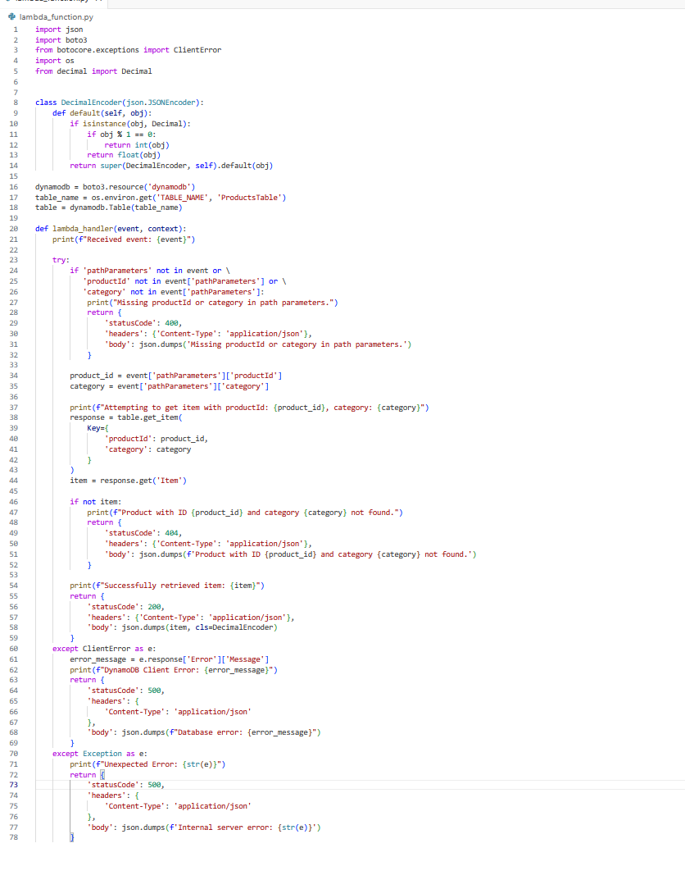

### `updateproductfunction` (PUT)

 - Click *Create function*.
   - Author from scratch: Select this option.
   - `getproductfunction`
   - Runtime: Select Python 3.9.
   - Architecture: x86_64.
   - Execution role:
   - Select "Create a new role with basic Lambda permissions". This will create a basic role that allows Lambda to write logs to CloudWatch.
   - Click *Create function *.
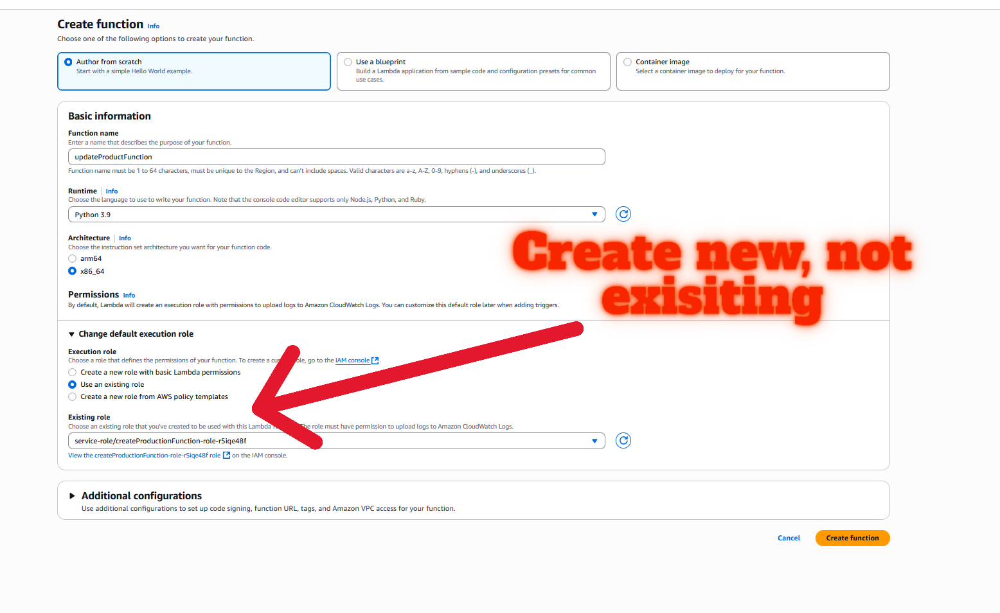
 - Configure Function Code for each Lambda (Python):
   - Once the function is created, you'll be on its configuration page.
   - Scroll down to the "Code source" section.
   - Replace the default code with the below Python code.

```python

import json
import boto3
from botocore.exceptions import ClientError
import os
from decimal import Decimal 

class DecimalEncoder(json.JSONEncoder):
    def default(self, obj):
        if isinstance(obj, Decimal):
            if obj % 1 == 0:
                return int(obj)
            return float(obj)
        return super(DecimalEncoder, self).default(obj)

dynamodb = boto3.resource('dynamodb')
table_name = os.environ.get('TABLE_NAME', 'ProductsTable') 
table = dynamodb.Table(table_name)

def lambda_handler(event, context):
    print(f"Received event: {event}")

    body_data = {} 

    if 'body' in event:
        if isinstance(event['body'], str):   
            try:
                body_data = json.loads(event['body'])
            except json.JSONDecodeError:
                print("Invalid JSON format in event['body'] string.")
                return {
                    'statusCode': 400,
                    'headers': {'Content-Type': 'application/json'},
                    'body': json.dumps('Invalid JSON format in request body.')
                }
        elif isinstance(event['body'], dict):
            body_data = event['body']
        else:
            print(f"Unexpected type for event['body']: {type(event['body'])}")
            return {
                'statusCode': 400,
                'headers': {'Content-Type': 'application/json'},
                'body': json.dumps('Invalid request body format.')
            }
    else:
        print("No 'body' field found in the event.")
        return {
            'statusCode': 400,
            'headers': {'Content-Type': 'application/json'},
            'body': json.dumps('Request body is missing.')
        }

    try:
       
        if 'pathParameters' not in event or \
           'productId' not in event['pathParameters'] or \
           'category' not in event['pathParameters']:
            print("Missing productId or category in path parameters.")
            return {
                'statusCode': 400,
                'headers': {'Content-Type': 'application/json'},
                'body': json.dumps('Missing productId or category in path parameters.')
            }

        product_id = event['pathParameters']['productId']
        category = event['pathParameters']['category']

  
        update_expression_parts = []
        expression_attribute_values = {}
        expression_attribute_names = {}

        if 'productName' in body_data:
            update_expression_parts.append('#N = :name')
            expression_attribute_values[':name'] = body_data['productName']
            expression_attribute_names['#N'] = 'productName'

        if 'productPrice' in body_data:
            update_expression_parts.append('#P = :price')
            expression_attribute_values[':price'] = Decimal(str(body_data['productPrice']))
            expression_attribute_names['#P'] = 'productPrice'

        if 'description' in body_data:
            update_expression_parts.append('#D = :desc')
            expression_attribute_values[':desc'] = body_data['description']
            expression_attribute_names['#D'] = 'description'

        if 'stock' in body_data:
            update_expression_parts.append('#S = :stock')
            expression_attribute_values[':stock'] = Decimal(str(body_data['stock']))
            expression_attribute_names['#S'] = 'stock'

        if not update_expression_parts:
            print("No valid update fields provided in the request body (body_data was empty after checks).")
            return {
                'statusCode': 400,
                'headers': {'Content-Type': 'application/json'},
                'body': json.dumps('No update fields provided.')
            }

        update_expression = 'SET ' + ', '.join(update_expression_parts)
        
        print(f"Attempting to update item with productId: {product_id}, category: {category}")
        print(f"UpdateExpression: {update_expression}")
        print(f"ExpressionAttributeValues: {expression_attribute_values}")
        print(f"ExpressionAttributeNames: {expression_attribute_names}")

        response = table.update_item(
            Key={
                'productId': product_id,
                'category': category # 
            },
            UpdateExpression=update_expression,
            ExpressionAttributeValues=expression_attribute_values,
            ExpressionAttributeNames=expression_attribute_names if expression_attribute_names else None,
            ReturnValues='UPDATED_NEW'
        )

        print(f"Item updated successfully! Updated Attributes: {response.get('Attributes', {})}")

        return {
            'statusCode': 200,
            'headers': {'Content-Type': 'application/json'},
            'body': json.dumps({
                'message': 'Product updated successfully!',
                'updatedAttributes': response.get('Attributes', {})
            }, cls=DecimalEncoder)
        }
    except ClientError as e:
        error_message = e.response['Error']['Message']
        print(f"DynamoDB Client Error: {error_message}")
        return {
            'statusCode': 500,
            'headers': {'Content-Type': 'application/json'},
            'body': json.dumps(f"Database error: {error_message}")
        }
    except Exception as e:
        print(f"Unexpected Error: {str(e)}")
        return {
            'statusCode': 500,
            'headers': {'Content-Type': 'application/json'},
            'body': json.dumps(f'Internal server error: {str(e)}')
        }
```
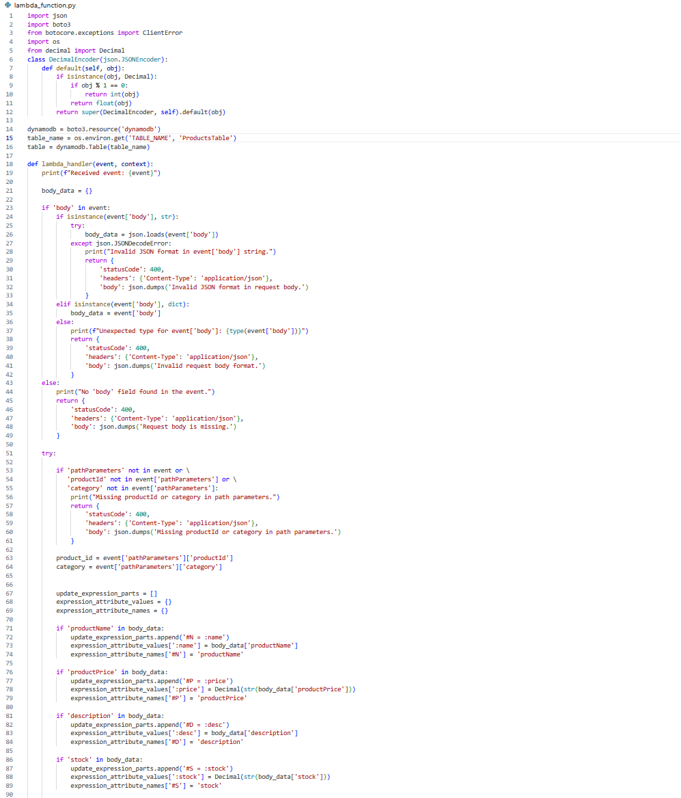

### `deleteproductfunction` (DELETE)

 - Click *Create function*.
   - Author from scratch: Select this option.
   - `deleteproductfunction`
   - Runtime: Select Python 3.9
   - Architecture: x86_64.
   - Execution role:
   - Select "Create a new role with basic Lambda permissions". This will create a basic role that allows Lambda to write logs to CloudWatch.
   - Click *Create function*.
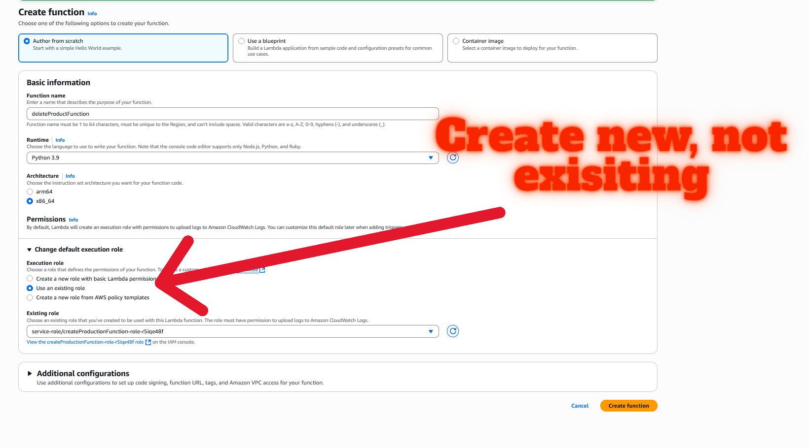
 - Configure Function Code for each Lambda (Python):
   - Once the function is created, you'll be on its configuration page.
   - Scroll down to the "Code source" section.
   - Replace the default code with the below Python code.

```Python
import json
import boto3
from botocore.exceptions import ClientError

dynamodb = boto3.resource('dynamodb')
table = dynamodb.Table('ProductsTable') 

def lambda_handler(event, context):
    try:
        if 'pathParameters' not in event or 'productId' not in event['pathParameters']:
            return {
                'statusCode': 400,
                'headers': {'Content-Type': 'application/json'},
                'body': json.dumps('Missing productId in path.')
            }

        product_id = event['pathParameters']['productId']

        response = table.delete_item(
            Key={
                'productId': product_id
            },
            ReturnValues='ALL_OLD'
        )

        if 'Attributes' not in response:
            return {
                'statusCode': 404,
                'headers': {'Content-Type': 'application/json'},
                'body': json.dumps(f'Product with ID {product_id} not found or already deleted.')
            }

        return {
            'statusCode': 200,
            'headers': {'Content-Type': 'application/json'},
            'body': json.dumps(f'Product {product_id} deleted successfully.')
        }
    except ClientError as e:
        print(f"DynamoDB Client Error: {e.response['Error']['Message']}")
        return {
            'statusCode': 500,
            'headers': {'Content-Type': 'application/json'},
            'body': json.dumps(f"Database error: {e.response['Error']['Message']}")
        }
    except Exception as e:
        print(f"Unexpected Error: {str(e)}")
        return {
            'statusCode': 500,
            'headers': {'Content-Type': 'application/json'},
            'body': json.dumps(f'Internal server error: {str(e)}')
        }
```


## Phase 3: IAM Permissions

Modify the execution roles for the Lambda functions.
 - Access IAM Console:
   - Navigate to the IAM service in the AWS Management Console.
 - Locate Lambda Execution Roles:
   - Go to "Roles" in the left navigation pane.

### POST Role
 - Search for the roles created by Lambda (they typically start with the function name).
   - Click on the role associated with `createProductFunction`.
 - Add DynamoDB Permissions:
   - On the role summary page, click *Add permissions* -> *Create inline policy*.
   - Service: Choose "DynamoDB".
   - Actions:
   - Under "Write", select PutItem.
  - Resources:
   - Select Specific.
   - Click *Add ARN* under table.
   - Enter the ARN of the `ProductsTable` (you can find this on the DynamoDB table's "Overview" tab).
   - Leave indexes ARN blank 
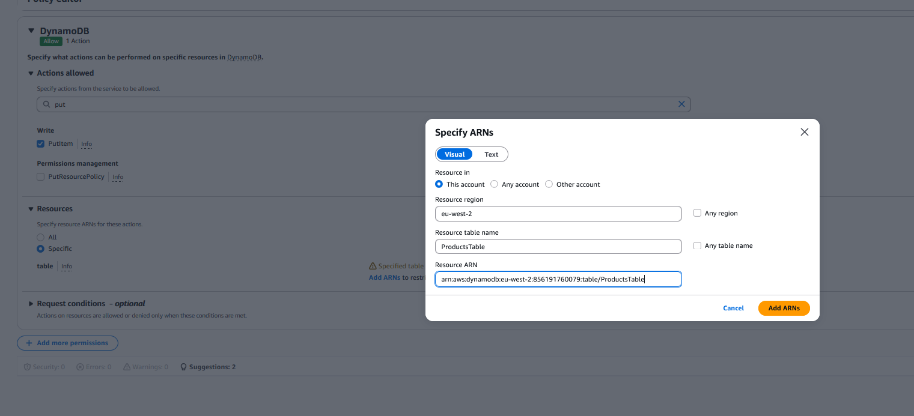
  
   - Click *Review policy*.
   - Policy name: `createProductFunction`
   - Click *Create policy*.
 - Verify CloudWatch Logs Permission:
   - Ensure AWSLambdaBasicExecutionRole is attached.

### Get Role
 - Search for the roles created by Lambda (they typically start with the function name).
   - Click on the role associated with `getProductFunction`.
 - Add DynamoDB Permissions:
   - On the role summary page, click *Add permissions* -> *Create inline policy*.
   - Service: Choose "DynamoDB".
   - Actions:
   - Under "Read", select GetItem, Query, Scan.
 - Resources:
   - Select Specific.
   - Click *Add ARN* under table.
   - Enter the ARN of the `ProductsTable` (you can find this on the DynamoDB table's "Overview" tab).
   - Leave indexes ARN blank 

   - Click *Review policy*.
   - Policy name: `getProductfunction`
   - Click *Create policy*.
 - Verify CloudWatch Logs Permission:
   - Ensure AWSLambdaBasicExecutionRole is attached.

### Put Role
   - Search for the roles created by Lambda (they typically start with the function name).
   - Click on the role associated with `updateProductFunction`.
 - Add DynamoDB Permissions:
   - On the role summary page, click *Add permissions* -> *Create inline policy*.
   - Service: Choose "DynamoDB".
   - Actions:
   - Under "Write", select UpdateItem.
   - Resources:
   - Select Specific.
   - Click *Add ARN* under table.
   - Enter the ARN of the `ProductsTable` (you can find this on the DynamoDB table's "Overview" tab).
   - Leave indexes ARN blank 

   - Click *Review policy*.
   - Policy name: `updateProductfunction`
   - Click *Create policy*.
 - Verify CloudWatch Logs Permission:
   - Ensure AWSLambdaBasicExecutionRole is attached.

### Delete Role
   - Search for the roles created by Lambda (they typically start with the function name).
   - Click on the role associated with `deleteproductfunction`.
 - Add DynamoDB Permissions:
   - On the role summary page, click *Add permissions* -> *Create inline policy*.
   - Service: Choose "DynamoDB".
   - Actions:
   - Under "Write", selecct DeleteItem.
   - Resources:
   - Select Specific.
   - Click *Add ARN* under table.
   - Enter the ARN of the `ProductsTable` (you can find this on the DynamoDB table's "Overview" tab).
   - Leave indexes ARN blank 

   - Click *Review policy*.
   - Policy name: `getProductfunction`
   - Click *Create policy*.
 - Verify CloudWatch Logs Permission:
   - Ensure AWSLambdaBasicExecutionRole is attached.

## Phase 4: API Gateway Creation

 - Access API Gateway Console:
   - Navigate to the API Gateway service.
 - Create REST API:
   - Click *Create API*.
   - Choose Protocol: "REST API" (choose "Build").
   - API name: `ProductsAPI`.
   - Endpoint Type: "Regional".
   - Click *Create API*.
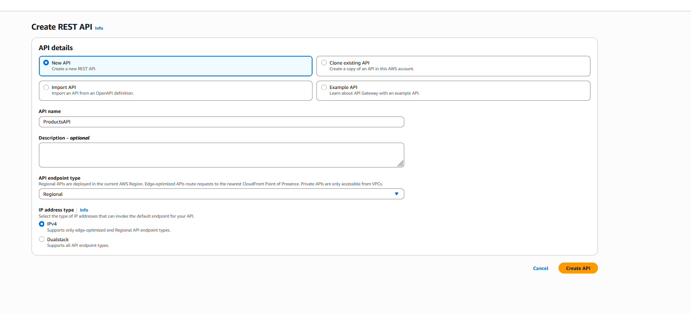
 - Create Resources and Methods:
   - Create Resource (/products):
   - From the API Gateway console, select the ProductsAPI.
   - Under "Resources", click *Actions* -> *Create Resource*.
   - Resource Name: products
   - Resource Path: products
   - Click *Create Resource*.

 - Create Method (POST for /products):
   - Select the /products resource.
   - Click *Actions* -> *Create Method*.
   - Select POST from the dropdown.
   - Integration type: "Lambda Function".
   - Lambda Region: Select the AWS region.
   - Lambda Function: Start typing `createProductFunction` and select it.
   - Click *Save*. When prompted, click *OK* to give API Gateway permissions to invoke the Lambda function.

 - Create Resource (/{productId} under /products):
   - Select the /products resource.
   - Click *Actions* -> "Create Resource".
   - Resource Name: productId
   - Resource Path: {productId} (Note the curly braces for path parameter)
   - Click *Create Resource*.
  - Create GET for /{productId}:
   - Click *Actions* -> *Create Method*.
   - Select GET from the dropdown.
   - Integration type: "Lambda Function".
   - Lambda Region: Select the AWS region.
   - Lambda Function: Start typing `getProductFunction` and select it.
   - Click *Save*. When prompted, click *OK* to give API Gateway permissions to invoke the Lambda function.
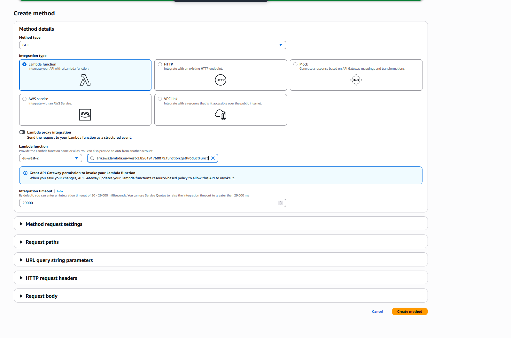
 - Create PUT for /{productId}:
   - Click *Actions* -> *Create Method*.
   - Select PUT from the dropdown.
   - Integration type: "Lambda Function".
   - Lambda Region: Select the AWS region.
   - Lambda Function: Start typing `updateProductFunction` and select it.
   - Click *Save*. When prompted, click *OK* to give API Gateway permissions to invoke the Lambda function.
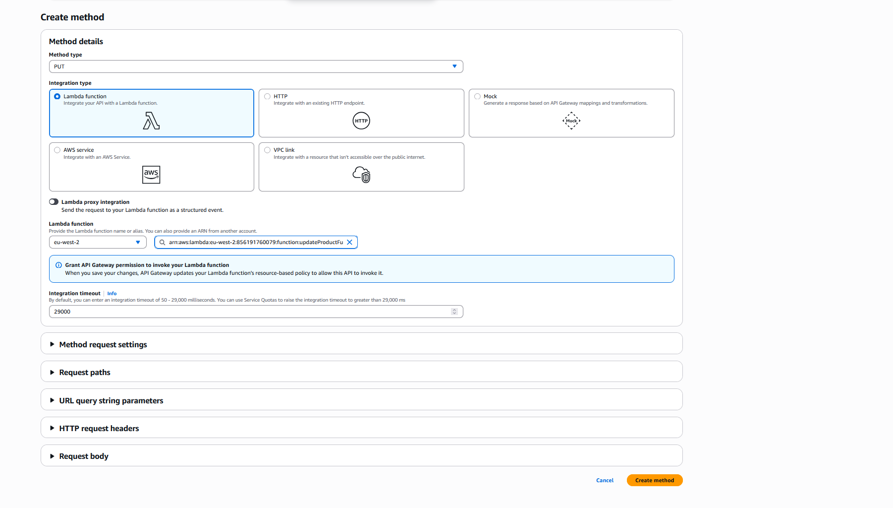
 - Create DELETE for /{productId}:
   - Click *Actions* -> *Create Method*.
   - Select DELETE from the dropdown.
   - Integration type: "Lambda Function".
   - Lambda Region: Select the AWS region.
   - Lambda Function: Start typing `deleteProductFunction` and select it.
   - Click *Save*. When prompted, click *OK* to give API Gateway permissions to invoke the Lambda function.
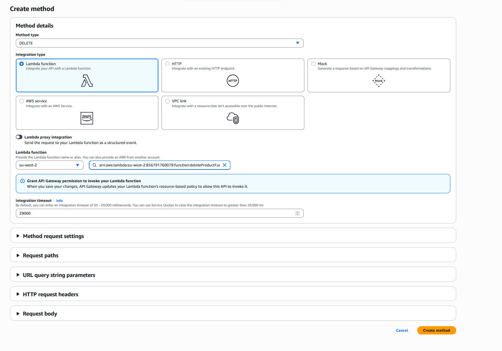


 - Deploy API:
   - From the API Gateway console, select the ProductsAPI.
   - Click *Actions* -> *Deploy API*.
   - Deployment stage: Select [New Stage].
   - Stage name: dev
   - Click *Deploy*.
   - Note down the "Invoke URL" for the API. This is the base URL you will use to test the API.
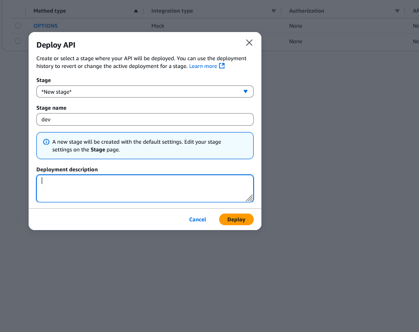


## Phase 5: Testing and Validation
 
 - Test `createProductFunction`:
   - In the Lambda console, select `createProductFunction`.
   - Select "add trigger".
   - Select "API Gateway".
   - Select the created API gateway.
   - Development stage: dev.
   - Security: IAM.
   - Click *Add*

 - Configure a test:
   - Click the *Test* tab.
   - Create new event.
   - Name: `Put-Item-Test`
   - Enter the below JSON and click *test*.

### POST (Create Products)
```JSON       
{
    "productId": "PROD001",
    "category": "Electronics",
    "productName": "Smartphone Model X",
    "description": "Latest model smartphone with advanced features.",
    "productPrice": 799,
    "stock": 150
}
```
 - If Successful (DynamoDB):
    - You should have a new entry in the DynamoDB table.

    - You should receive this response.
 - If successful (API Gateway):
    - You should receive a status code `200`.
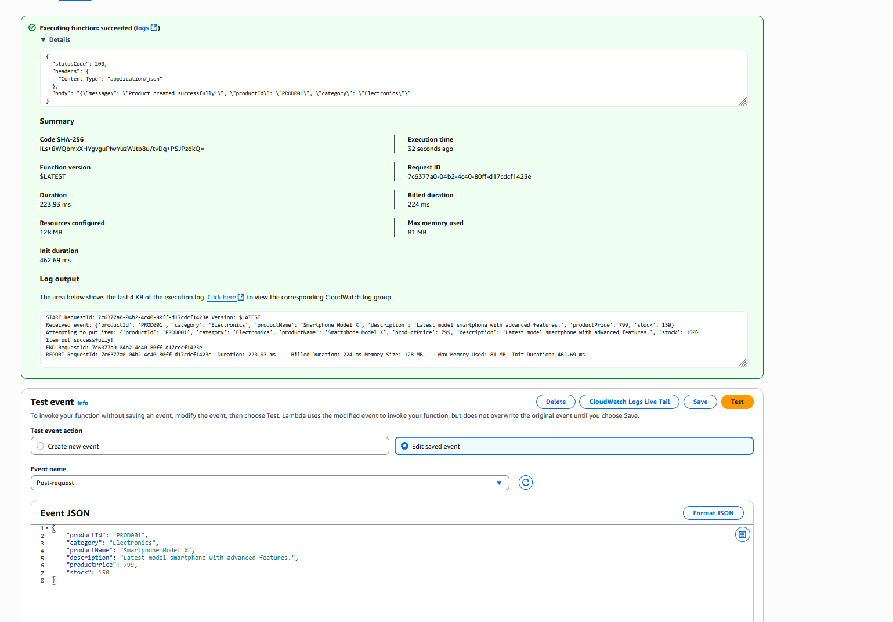


 - Test `getProductFunction`:
    - In the Lambda console, select `getProductFunction`.
    - Select "add trigger".
    - Select "API Gateway".
    - Select the created API gateway.
    - Development stage: dev.
    - Security: IAM.
    - Click *Add*

 - Configure a test:
    - Click the *Test* tab.
    - Create new event.
    - Name: `Put-Item-Test`
    - Enter the below JSON and click *test*.

### GET (Read Single Product):
```JSON
   {
    "pathParameters": {
        "productId": "PROD001",
        "category": "Electronics"
    }
}
```
 - If successful:
    - You should receive a status code `200`.


 - Test `updateProductFunction`:
   - In the Lambda console, select `updateProductFunction`.
   - Select "add trigger".
   - Select "API Gateway".
   - Select the created API gateway.
   - Development stage: dev.
   - Security: IAM.
   - Click *Add*

 - Configure a test:
   - Click the *Test* tab.
   - Create new event.
   - Name: `Put-Item-Test`
   - Enter the below JSON and click *test*.

### PUT (Update Product):
```JSON
{
  "pathParameters": {
    "productId": "PROD001",
    "category": "Electronics"
  },
  "body": {
    "productName": "Smartphone Model X v2",
    "productPrice": 849,
    "stock": 120
  }
```
 - If Successful (DynamoDB):
   - You should have a new entry in the DynamoDB table.

   - You should receive this response.
 - If successful (API Gateway):
   - You should receive a status code `200`.


 - Test `updateProductFunction`:
   - In the Lambda console, select `updateProductFunction`.
   - Select "add trigger".
   - Select "API Gateway".
   - Select the created API gateway.
   - Development stage: dev.
   - Security: IAM.
   - Click *Add*

 - Configure a test:
   - Click the *Test* tab.
   - Create new event.
   - Name: `Put-Item-Test`
   - Enter the below JSON and click *test*.

### DELETE (DELETE Product):
```JSON
{
    "pathParameters": {
        "productId": "PROD001",
        "category": "Electronics"
    }
}
```
 - If Successful (DynamoDB):
   - You should have a new entry in the DynamoDB table.

   - You should receive this response.
 - If successful (API Gateway):
   - You should receive a status code `200`.


Observe the responses and check CloudWatch logs for any errors or successful execution details.


## Phase 6: CloudWatch Logging and Monitoring

CloudWatch logging is automatically configured when you create a Lambda function with basic permissions.
- Access CloudWatch Console:
   - Navigate to the CloudWatch service.
 - View Lambda Logs:
   - In the left navigation pane, under "Logs", click "Log groups".
   - You will see log groups for the Lambda functions (e.g., /aws/lambda/`createproductfunction`).
   - Click on a log group to see the log streams, which contain the output from the Lambda function's executions (including print statements or errors).


## Phase 7: Add Cognito for User Authentication

This phase significantly enhances the "Secure" aspect of the project by integrating user authentication.

- Log in to the AWS Management Console and navigate to the Cognito service.
  - Create a New User Pool:
   - Click Create user pool.
   - Select "Single-page application"
   - Name: `ProductsWebAppClient`.
   - Configure Options: Select Username.
   - Required attributes: email .
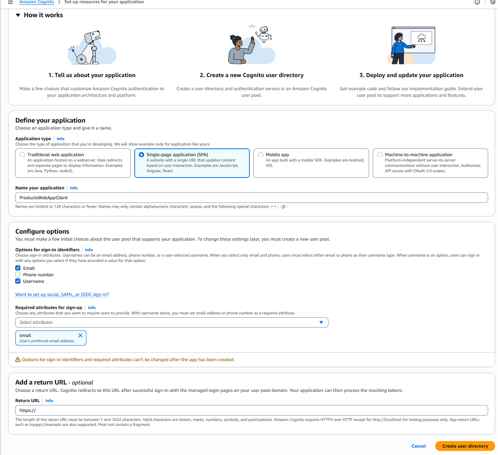
 - Return to Cognito and select the newly created user pool.
   - Click *Rename*.
   - Name: `secure-serverless-app` 
   - Click *Save changes*
 - Enable password auth.
   - Select App clients.
   - Select MyProducts App.
   - Click *edit*.
   - Enable "Sign in with username and password: ALLOW_USER_PASSWORD_AUTH"
   - Click *Save changes*
[Enable Password Auth](visual-guides/7.enable-password-auth.png)

 - Integrate Cognito with API Gateway
   - Create a Cognito Authorizer:
   - In the API Gateway console, navigate to the ProductsAPI.
   - In the left navigation pane, select Authorizers.
   - Click *Create new authorizer*.
   - Name: Enter `CognitoUserAuth`.
   - Type: Select "Cognito."
   - Cognito User Pool: Select the user pool created in the previous step from the dropdown.
   - Token Source: Enter Authorization.
   - Click *Create*.
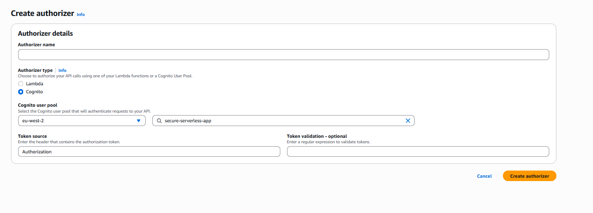
 - Apply Authorizer to API Methods:
   - Select the POST method on /products.
   - Click on *Method Request*.
   - For "Authorization," select the CognitoUserAuth authorizer.
   - Click *save*.

   
   Deploy API:
   - In API Gateway, navigate to Resources.
   - From the "Actions" dropdown, select Deploy API.
   - Choose the existing deployment stage and confirm to overwrite.
   - Click *Deploy*.
   - Record the Invoke URL for the API Gateway stage.

 - Modify Lambda Functions to Process Authenticated Requests.
   - Access the Lambda Console:
   -  Navigate to the Lambda functions createproductfunction.
 - Update Lambda Function Code:
   - In the "Code source" section of the Lambda function, amend to the below code.

```python
import json
import boto3
from botocore.exceptions import ClientError
import os 

dynamodb = boto3.resource('dynamodb')
table_name = os.environ.get('TABLE_NAME', 'ProductsTable')
table = dynamodb.Table(table_name)


def lambda_handler(event, context):
    print("Received event: " + json.dumps(event, indent=2)) 

    user_id = None
    email = None
    if 'requestContext' in event and \
       'authorizer' in event['requestContext'] and \
       'claims' in event['requestContext']['authorizer']:

        claims = event['requestContext']['authorizer']['claims']
        user_id = claims.get('sub')
        email = claims.get('email')

        print(f"Authenticated User ID: {user_id}")
        print(f"Authenticated User Email: {email}")

    print(f"Received event: {event}")

    product_data = None
    if 'body' in event and isinstance(event['body'], str):
        try:
            product_data = json.loads(event['body'])
        except json.JSONDecodeError:
            print("Invalid JSON format in event['body']")
            return {
                'statusCode': 400,
                'headers': {'Content-Type': 'application/json'},
                'body': json.dumps('Invalid JSON format in request body.')
            }
    else:
        product_data = event

    if not product_data:
        print("No valid product_data extracted from event.")
        return {
            'statusCode': 400,
            'headers': {'Content-Type': 'application/json'},
            'body': json.dumps('No data provided in the request.')
        }

    required_fields = ['productId', 'category', 'productName', 'productPrice']
    missing_fields = [field for field in required_fields if field not in product_data]

    if missing_fields:
        print(f"Missing required fields: {', '.join(missing_fields)}")
        return {
            'statusCode': 400,
            'headers': {'Content-Type': 'application/json'},
            'body': json.dumps(f"Missing required fields: {', '.join(missing_fields)}")
        }

    try:
        product_id = product_data['productId']
        category = product_data['category']
        product_name = product_data['productName']
        product_price = product_data['productPrice']

        item = {
            'productId': product_id,
            'category': category,
            'productName': product_name,
            'productPrice': product_price
        }
        for key, value in product_data.items():
            if key not in required_fields:
                item[key] = value

        print(f"Attempting to put item: {item}")
        table.put_item(Item=item)
        print("Item put successfully!")

        return {
            'statusCode': 200,
            'headers': {
                'Content-Type': 'application/json'
            },
            'body': json.dumps({'message': 'Product created successfully!', 'productId': product_id, 'category': category})
        }
    except ClientError as e:
        error_message = e.response['Error']['Message']
        print(f"DynamoDB Client Error: {error_message}")
        return {
            'statusCode': 500,
            'headers': {
                'Content-Type': 'application/json'
            },
            'body': json.dumps(f"Database error: {error_message}")
        }
    except Exception as e:
        print(f"Unexpected Error: {str(e)}")
        return {
            'statusCode': 500,
            'headers': {
                'Content-Type': 'application/json'
            },
            'body': json.dumps(f"Internal server error: {str(e)}")
        } 
```

## 8. Testing Secured Endpoints
Use the AWS Command Line Interface (CLI) to simulate user interactions with Cognito and then curl to send authenticated requests to the API Gateway.

 - Create and Confirm a Test User (using AWS CLI)
   - Sign Up a User:
   - Execute the following command in the terminal, replacing placeholders with the actual values:

`aws cognito-idp sign-up --region eu-west-2 --client-id` <ProductsWebAppClient Client ID> `--username testuser --password MySecurePass1! --user-attributes Name="email",Value="testuser@example.com"`


### Confirm the User:
To bypass email verification for testing, use admin-confirm-sign-up:

`aws cognito-idp admin-confirm-sign-up --region eu-west-2 --user-pool-id` <COGNITO_USER_POOL_ID> `--username testuser`


### Sign in and get the required tokens. The output will contain an AuthenticationResult. Copy the value of IdToken. This is the JSON web token.
`aws cognito-idp initiate-auth --region eu-west-2 --auth-flow USER_PASSWORD_AUTH --client-id` <APP_Client_ID> `--auth-parameters USERNAME=testuser,PASSWORD=MySecurePass1!`

 - The output will contain an AuthenticationResult. Copy the value of IdToken. This is the JWT.


### Test Secured API Gateway Endpoints (cURL)
```bash
 - Use the copied IdToken to make requests to the API.
    - On the AWS CLI paste the below. Amend for your specifc tokens.

```bash
curl -v -X POST \
-H "Content-Type: application/json" \
-H "Authorization: Bearer <PUT Id Token value here>" \
-d '{
    "productId": "PROD001",
    "category": "Electronics",
    "productName": "Smartphone Model X",
    "description": "Latest model smartphone with advanced features.",
    "productPrice": 799,
    "stock": 150
}' \
"https://a86cuh75k6.execute-api.eu-west-2.amazonaws.com/dev3/products"
```
 Expected Behavior: A successful cURL request will show a 200 OK HTTP status code.

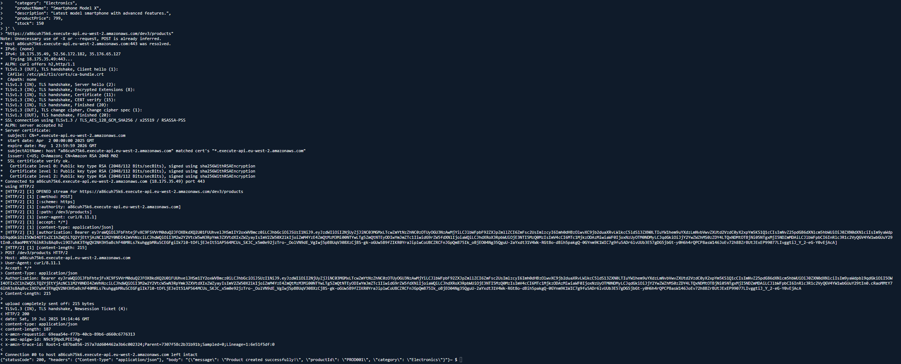

